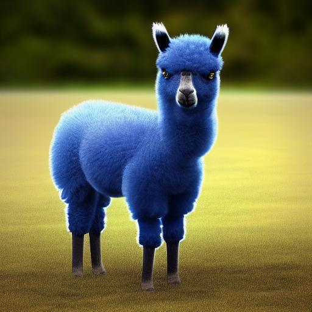

# LAAMA2C



"Laama2c" has been meticulously refined, modularized, and transformed into a structured library, stemming from [Andrei Karpathy's llama2.c](https://github.com/karpathy/llama2.c) original "llama2.c" as a manually created fork. Certain array addressing techniques have been edited for enhanced clarity.

The central objective of this repository is to document my personal journey of learning about large language models. I am optimistic that this endeavor might prove beneficial to others as well.

"Laama2c" has been authored in the form of a library, accompanied by an available Golang wrapper.

For the implementation of high-quality production-level interference, I recommend exploring established libraries such as [llama.cpp](https://github.com/ggerganov/llama.cpp/blob/master/llama.cpp) which includes support for quantization and related features.


# Usage

## Get models?
Follow instructions on Karpathy's original repository

## Use in C
go to dir example1 

Edit row so model and tokenizer.bin files match to yours
```c
    if (initLaama2(&laama ,"/home/henri/aimallit/llama2.c/model.bin","/home/henri/aimallit/llama2.c/tokenizer.bin")){
```

shell script *compile.sh* includes minimal command for building software

## Use in golang

Just import
*"github.com/hjkoskel/laama2c"*

and check example cmd/laama2ongo subfolder